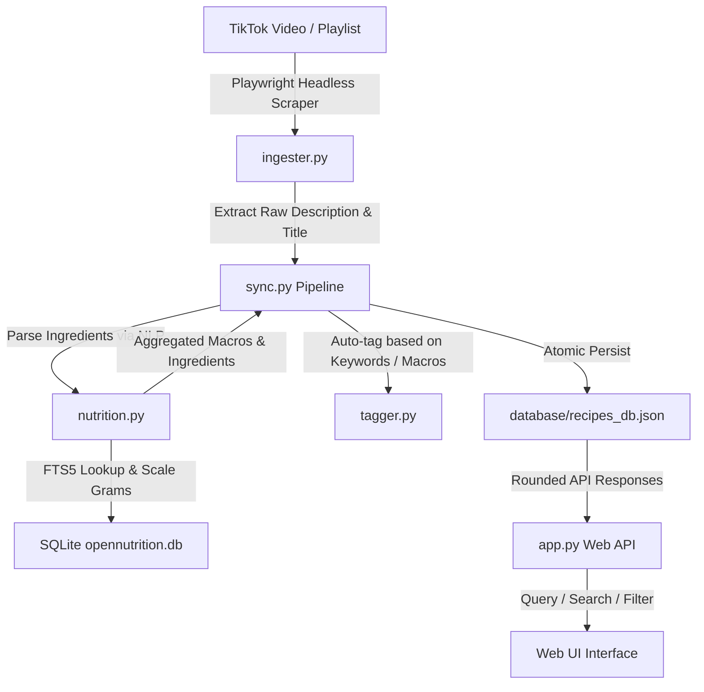

# Grams — Recipe Ingestion & Database Engine

Grams is a highly structured, local-first recipe cataloging, nutritional analysis, and meal planning system. It automates scraping TikTok recipe videos, parsing ingredients using Natural Language Processing (NLP), mapping them to a local SQLite food database, auto-tagging diets and methods, and exposing a modern Web UI for searching and filtering.

---

## Project Structure

The project has been organized into a professional, modular architecture:

```
Grams/
├── database/                # Persistence & Canonical Schemas
│   ├── __init__.py          # Database package exports
│   ├── database.py          # Thread-safe PostgreSQL database engine
│   └── models.py            # Dataclasses matching required schemas
├── interface/               # Frontend Assets
│   ├── index.html           # Modern Web UI (rebranded Macro Finder)
│   ├── manifest.json        # Progressive Web App manifest
│   ├── sw.js                # Service Worker for offline/caching support
│   └── baker.png            # Application logo
├── helpers/                 # Application Core Logic
│   ├── __init__.py          # Helpers package exports
│   ├── engine.py            # RecipeEngine Orchestrator/Facade
│   ├── ingester.py          # Playwright TikTok Scraper (Playlist/Single)
│   ├── nutrition.py         # OpenNutrition offline SQLite & FTS5 search
│   ├── query.py             # Read-only search & filter interfaces
│   ├── sync.py              # Recipe Sync Pipeline logic
│   └── tagger.py            # Rule-based auto-tagging engine
├── data/                    # Heavy Offline Datasets
│   ├── opennutrition.db     # Local SQLite index for food lookup
│   └── opennutrition_foods.tsv
├── app.py                   # Flask Web Server
├── config.py                # Centralized configurations & paths
├── sync_recipes.py          # CLI continuous rate-limited synchronization
├── requirements.txt         # Package dependencies
└── README.md                # System documentation
```

---

## Core Architecture & Data Flow



### 1. Headless TikTok Scraper (`helpers/ingester.py`)

- Uses **Playwright** with custom user-agents to render JavaScript-heavy TikTok page structures.
- Supports injecting cookies from `tiktok_cookies.json` to bypass logins and bot detection.
- Exposes two scraper behaviors:
  - **Fast Playlist Scrape**: Extracts links, titles, and alt descriptions directly from the playlist grid.
  - **Detailed Video Scrape**: Visits individual video pages to grab full captions containing instructions/ingredients, parses hydration metadata from scripts (`SIGI_STATE`), and handles DOM fallback selectors.

### 2. NLP Ingredient Parsing & Local SQLite Lookup (`helpers/nutrition.py`)

- Utilizes the `ingredient-parser` NLP package to extract quantities, units, and food names from free-text descriptions.
- Queries a local SQLite index of the **OpenNutrition dataset** (a curated 100g metric dataset) using an FTS5 full-text search index for fast name matching.
- Automatically handles:
  - **Serving Estimations**: Detects phrasing like "serves 4" to automatically scale and divide total recipe macros.
  - **Weight Scaling**: Automatically converts non-metric units (e.g. cups, tbsp, tsp, ounces, eggs, cloves) to equivalent metric weights in grams.
  - **Atwater fallback**: Automatically estimates calories based on standard macronutrient ratios if direct database energy lookups fail.

### 3. Thread-Safe PostgreSQL Backend (`database/database.py`)

- Employs a PostgreSQL database connection with dedicated tables for active and unfilled recipes.
- Access is thread-safe, utilizing connection pooling/management suited for concurrent environments.

### 4. Rule-Based Auto-Tagger (`helpers/tagger.py`)

- Automatically assigns diet tags (e.g., `High-Protein`, `Keto-Friendly`, `Low-Calorie`) based on calculated macros.
- Scans recipe names and descriptions against configurable keyword mappings (defined in `config.py`) to auto-assign style tags (e.g., `Meal Prep`, `Breakfast`, `Air Fryer`, `Seafood`, `Vegan`).
- Merges auto-generated tags with manual overrides.

---

## Installation & Setup

1. **Install Python dependencies**:

   ```bash
   pip install -r requirements.txt
   ```

2. **Install Playwright Browsers**:

   ```bash
   playwright install chromium
   ```

3. **Configure Authentication (Optional but recommended)**:
   Export your TikTok session cookies to `tiktok_cookies.json` in the project root folder. The JSON structure should look like this:

   ```json
   [
     {
       "name": "sessionid",
       "value": "YOUR_SESSION_ID_HERE",
       "domain": ".tiktok.com",
       "path": "/"
     }
   ]
   ```

4. **Initialize OpenNutrition Database**:
   The engine automatically downloads and builds the index under `data/opennutrition.db` on first run of either the web server, CLI tool, or test runner.

---

## Ingesting Recipes

### Continuous Slow Synchronization (Recommended)

Use the `sync_recipes.py` CLI script to scrape a playlist. It extracts all video links, checks the local database, and visits detailed pages for **new videos only**, sleeping between page hits to keep you safe from rate limits:

```bash
# Sync playlist with default 5-second delay
python sync_recipes.py "https://www.tiktok.com/@creator/playlist/1234567"

# Sync with custom rate-limiting (e.g., 10-second delay)
python sync_recipes.py "https://www.tiktok.com/@creator/playlist/1234567" --delay 10.0
```

---

## Running the Web Application

1. **Start the Flask Web Server**:

   ```bash
   python app.py
   ```

2. **Access the Web Interface**:
   Open your browser and navigate to: [http://127.0.0.1:5000/](http://127.0.0.1:5000/)

---

## Web API Routes

- `GET /` — Serves the main SPA `interface/index.html`.
- `GET /recipes_db.json` — Returns the canonical database with macro numbers rounded to integers.
- `POST /api/recipes/calculate_macros` — Calculates recipe macros dynamically from a list of ingredient dictionaries.
- `POST /api/recipes/update` — Atomically edits a recipe record, recalculating macros strictly from ingredient items.
- `GET /api/ingredients/search` — Runs prefix-matching FTS5 queries against `opennutrition.db` to autocomplete frontend ingredient edits.
- `GET /api/barcode/lookup` — Performs barcode lookup from the local DB or proxies to Open Food Facts API (and caches it locally).

## Automated Ingestion with GitHub Actions

This repository is pre-configured with a GitHub Actions workflow to run the TikTok Recipe Scraper automatically every hour (or manually on-demand).

### Step 1: Set up Repository Secrets
In your GitHub repository, go to **Settings** > **Secrets and variables** > **Actions** and add the following repository secrets:

- `SUPABASE_URL`: Your Supabase API endpoint URL (e.g. `https://pptghabcewxfaaiplkmi.supabase.co`).
- `SUPABASE_KEY`: Your Supabase API Service Role key (or anon key if Row-Level Security is disabled/configured to allow anonymous inserts).
- `GROQ_API_KEY`: Your Groq API key for Llama 3.3 parsing.
- `SUPADATA_API_KEY`: Your Supadata API key for TikTok video transcript extraction.
- `TIKTOK_COOKIES_JSON`: A JSON string containing your exported TikTok session cookies (e.g. `[{"name": "...", "value": "..."}]`).

### Step 2: Configure Playlist URL (Optional)
If you want to sync a playlist other than the default hardcoded one, add this repository secret:
- `TIKTOK_PLAYLIST_URL`: The URL of the TikTok collection or playlist to sync.

### Step 3: Trigger Scraper
The workflow runs automatically every hour. To trigger it manually:
1. Navigate to the **Actions** tab of your repository on GitHub.
2. Select the **TikTok Recipe Scraper** workflow.
3. Click the **Run workflow** dropdown and click the green button.
